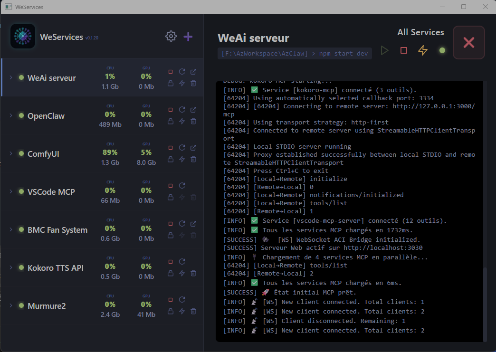
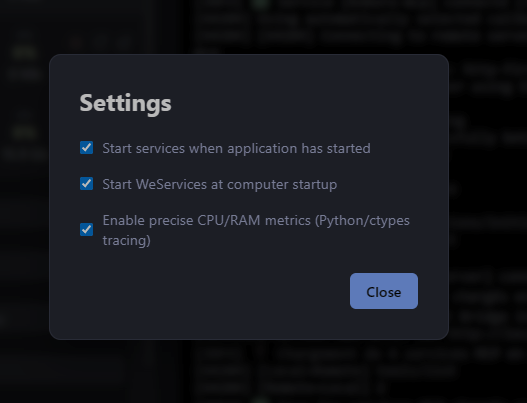
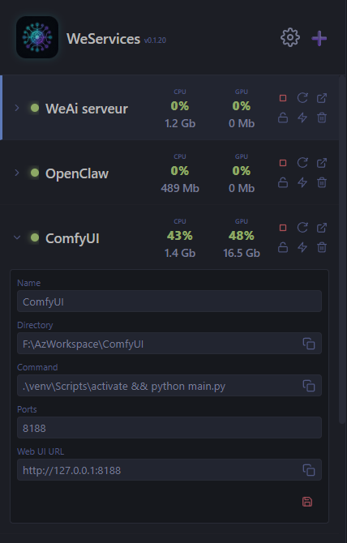

# 🚀 WeServices 

<div align="center">
  
  <h3>The AI Dev's Best Friend</h3>
</div>


<div align="center">
  
</div>

**WeServices** is a blazing-fast, lightweight desktop application built with [Bun](https://bun.sh) to manage all your local development servers, APIs, and background tasks in one beautiful interface. 

## 🤔 Why does this exist? (The AI Dev Problem)

If you are a developer—*especially* if you code alongside AI assistants like Cursor, Copilot, or Claude—you know the pain:
1. You have a frontend running (`npm run dev`).
2. You have a backend API running (`python main.py`).
3. You have an MCP server running for your AI.
4. You have a database container or a local proxy running.

Suddenly, you have 5 different terminal windows open. One of them crashes. Another one gets stuck and holds port `3000` hostage (the dreaded `EADDRINUSE` zombie 🧟‍♂️). You hunt down process IDs, you restart terminals, you lose your flow.

**Even worse:** Every time you reboot, you have to remember *"Wait, what was the exact command to start the backend again? What directory was the MCP server in?"*

**WeServices** fixes this. It acts as your **Launch Command Vault** and your Control Panel. Never dig through bash history or READMEs again to find out how to start a project.

## 🎬 See it in Action

https://github.com/user-attachments/assets/dac219cd-6caf-4ce9-ba70-59e598d0462f


## ✨ Features

- 🚦 **Dedicated Global Controls**: Independent 'Start All' and 'Stop All' buttons to reliably launch or safely terminate all services instantly.
- 🟠 **Smart LED Watcher**: Real-time global LED that glows green when all systems are operational, red when everything is stopped, and warning orange for mixed states.
- 🛡️ **Anti-Zombie Safe Exit**: Attempts to close the application with active services running will trigger a native OS warning intercept. Quit safely without leaving headless Node/Python processes haunting your RAM!
- 📈 **Real-Time Hardware Metrics**: Track CPU, RAM, GPU (%), and VRAM locally for all running processes on a beautiful dynamically scaled 3-line UI layout.
- 🎨 **Premium UI & Branding**: Beautiful dark-theme interface with custom double-sized Sidebar Logo and injected Favicon.
- 🚀 **Bulletproof Build Script**: The `Setup-WeServices.ps1` completely bypasses cross-origin limits, forces UI asset payload injections directly into the standalone `.exe`, and dynamically drops a shortcut for you.


- 🧠 **The Launch Vault**: It permanently stores all your exact launch commands, directories, and target ports. No more forgetting how to boot up a specific service.
- 🟢 **One-Click Start/Stop**: Start or stop individual services, or hit the **Global Play** button to boot up your entire stack at once.
- 🧟‍♂️ **Force Kill Zombies (Plumber)**: Did a service crash but keep its port open? Click the ⚡ (Zap) icon to magically find and ruthlessly murder the zombie process holding your port hostage.
- ⚙️ **Quick Settings**: Easily configure auto-start preferences, computer boot settings, and toggle the new high-precision hardware tracking engine.
  
  

- 📝 **Inline Editing**: Double-click any locked service to instantly open the inline editor. Change the starting directory, the boot command, or the target port on the fly.
  
  

- 🔄 **Drag & Drop Reordering**: Grab a service and drag it to organize your stack logically (e.g., Database first, Backend second, Frontend last). 
- 📊 **Real-time Terminal Output**: Click on any service to view its live terminal output safely sandboxed. Automatically strips ugly ANSI codes for clean reading.
- 🛡️ **Lock System**: Lock (🔒) critical services so you don't accidentally edit or delete them while working.

## 🛠️ Installation (The 1-Click Windows Way)

Because this app is built on **Bun** and **Electrobun**, it is incredibly fast and uses virtually zero memory compared to typical Electron apps.

### 1. Install Prerequisites
Make sure you have [Bun](https://bun.sh/) installed on your machine.
```powershell
powershell -c "irm bun.sh/install.ps1 | iex"
```

### 2. Clone the Repository
```bash
git clone https://github.com/PascalPaoli/WeServices.git
cd WeServices
bun install
```

### 3. Ultimate One-Click Setup 🚀
Run the setup script included for Windows users. It will automatically compile the project, rename the core engine to `WeServices.exe`, and place a clean **shortcut** right in your folder.
```powershell
.\Setup-WeServices.ps1
```
**Done!** Just double-click the newly created shortcut to launch the app.

---

### 👨‍💻 For UI Developers (Manual Run)
If you want to run it dynamically with Hot-Module Replacement to edit the visual interface:
```bash
# Generate the initial static dist folder
bun run build:canary

# Start in development mode
bun run dev
```

---
*Built with ❤️ for developers who just want to code, not manage terminals.*
